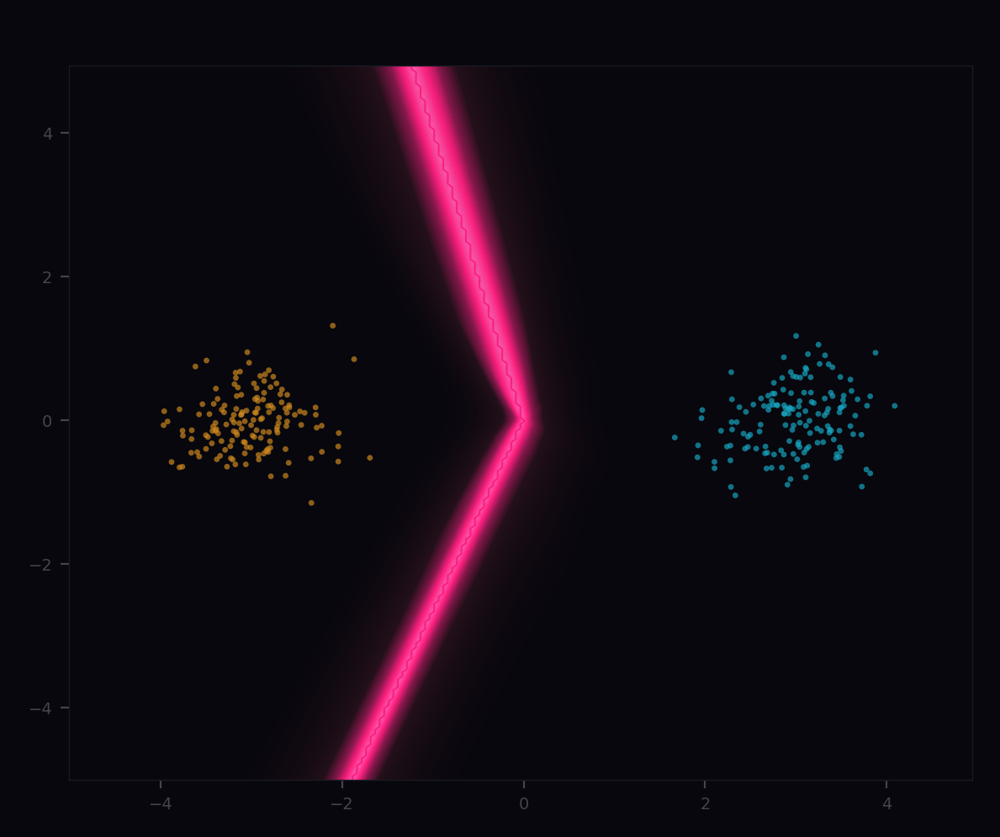
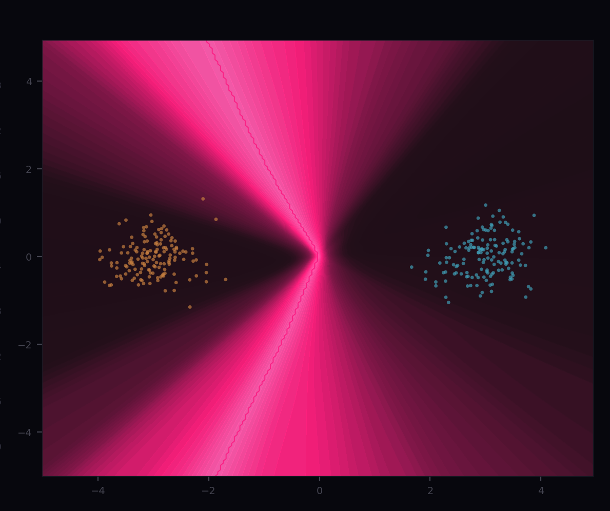
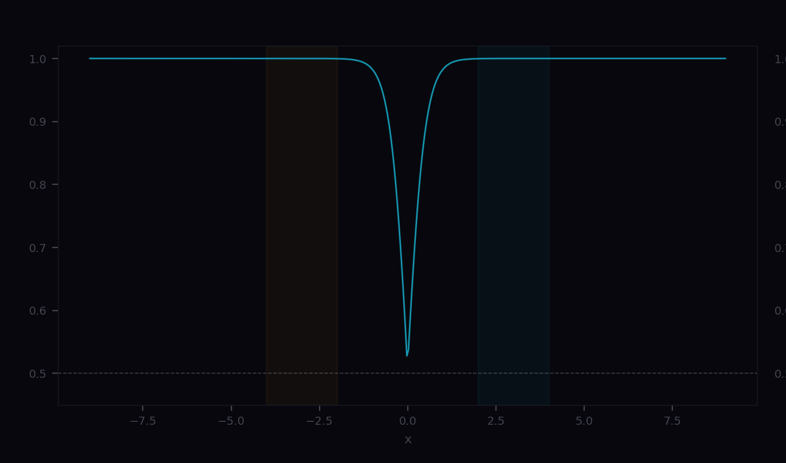
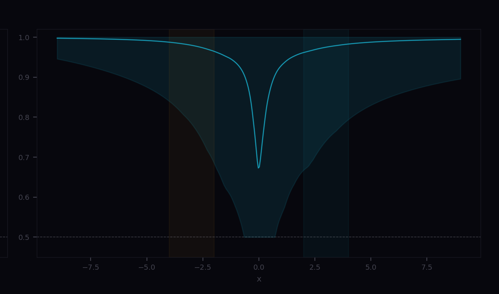

#### Neural Geometry

Building intuition for neural networks through simple models, visualization, and graphics programming. For the full write-up, see [adamsioud.com/projects/neural-geometry](https://www.adamsioud.com/projects/neural-geometry.html). The project uses NumPy, Numba, Matplotlib, and OpenGL, and is also very much a teaching ground for those too.

---

##### Setup

```bash
brew install uv
uv sync
```

##### Run

```bash
uv run neural-geometry [command]
```

| command    | description                                  |
| ---------- | -------------------------------------------- |
| `simple`   | simple neural network                        |
| `speed`    | forward pass and linear-region benchmark     |
| `relu`     | layerwise ReLU regions and decision boundary |
| `bayesian` | MAP vs last-layer Laplace approximation      |
| `regions`  | OpenGL ReLU region viewer                    |

---

<kbd>simple</kbd> &nbsp; [neural_geometry/simple.py](neural_geometry/simple.py)

Two-class classifier built from scratch in NumPy. Inspired by [Sylvain Gugger's numpy neural net](https://sgugger.github.io/a-simple-neural-net-in-numpy.html).

<kbd>speed</kbd> &nbsp; [neural_geometry/speed.py](neural_geometry/speed.py)

Two benchmarks: a dense forward pass and a linear-region labeling pass over a 2D grid. NumPy wins on the dense, vectorized case; Numba pulls ahead on the loop-heavy grid pass. I'm using this experiment to get a better feel for where Numba actually helps in practice, especially in the kind of numerical and visualization code that shows up around projects like this. For a concise introduction, see [Python⇒Speed](https://pythonspeed.com/articles/numba-faster-python/).

```
forward pass, 200 samples, 2 → 32 → 32

  python      30.75 ms
  numpy       0.0209 ms    1470x faster than python
  numba       0.0576 ms     534x faster than python    0.4x vs numpy

activation-region map, 600×600, 32 hidden units

  numpy      35.828 ms
  numba       6.963 ms     5.1x vs numpy
```

<kbd>relu</kbd> &nbsp; [neural_geometry/relu.py](neural_geometry/relu.py)

A from-scratch ReLU classifier on a radial-band dataset, with visualizations of layerwise regions, their joint partition, and the final decision boundary. Successive ReLU layers partition the plane into increasingly fine linear regions, and the resulting decision boundary emerges from that structure.

<p align="center"><em>Layerwise regions, their joint partition, and the resulting decision boundary</em></p>

<table>
  <tr>
    <td align="center" valign="middle"></td>
    <td align="center" valign="middle"></td>
    <td align="center" valign="middle"></td>
    <td align="center" valign="middle"></td>
  </tr>
  <tr>
    <td align="center">Layer 1</td>
    <td align="center">Layer 2</td>
    <td align="center">Joint partition</td>
    <td align="center">Decision boundary</td>
  </tr>
</table>

<p align="center"><em>Radial probes through the trained network</em></p>

<table>
  <tr>
    <td align="center" valign="middle"></td>
    <td align="center" valign="middle"></td>
  </tr>
  <tr>
    <td align="center">Logit difference vs radius</td>
    <td align="center">Confidence vs radius</td>
  </tr>
</table>

Along a fixed ray, the network moves through a sequence of activation regions. Inside each region the network is just an affine map, so the logit difference changes linearly with radius; the visible kinks mark where the ray crosses into a new region. Confidence dips near those crossings, but stays high almost everywhere else, importantly including far from the data.

<kbd>bayesian</kbd> &nbsp; [neural_geometry/bayesian.py](neural_geometry/bayesian.py)

Binary ReLU classifier with a last-layer Laplace approximation, inspired by [Kristiadi et al. 2020](https://arxiv.org/abs/2002.10118). This started from the overconfidence issue visible above: the point-estimate network stays highly confident even far from the training data. Here, only the last layer is treated probabilistically, which is enough to pull predictions back toward 0.5 in sparse regions.

<p align="center"><em>MAP vs last-layer Laplace confidence</em></p>

<table>
  <tr>
    <td align="center" width="24%"></td>
    <td align="center" width="24%"></td>
  </tr>
  <tr>
    <td align="center">MAP</td>
    <td align="center">LLLA</td>
  </tr>
</table>

<p align="center"><em>Confidence along a horizontal slice through the data gap</em></p>

<table>
  <tr>
    <td align="center" width="24%"></td>
    <td align="center" width="24%"></td>
  </tr>
  <tr>
    <td align="center">MAP</td>
    <td align="center">LLLA</td>
  </tr>
</table>

MAP quickly returns to near-1 confidence away from the data. The last-layer Laplace approximation relaxes toward 0.5 and shows wider predictive spread in regions with little or no training data.

<kbd>regions</kbd> &nbsp; [neural_geometry/gl_regions.py](neural_geometry/gl_regions.py)

OpenGL viewer for a ReLU network in training, showing how its joint activation regions evolve over time. As training progresses, the plane is reorganized into linear regions, while the decision boundary settles into a curved shape built from local linear pieces.

I made this largely because I have been learning OpenGL and wanted to use it on something. It felt like a good fit here: when you want to render many points, and do some computation, a graphics API starts to make a lot of sense. The viewer is very much hacked together, but it's using principles I've been learning for OpenGL, and I thought it was fun, and fitting.


