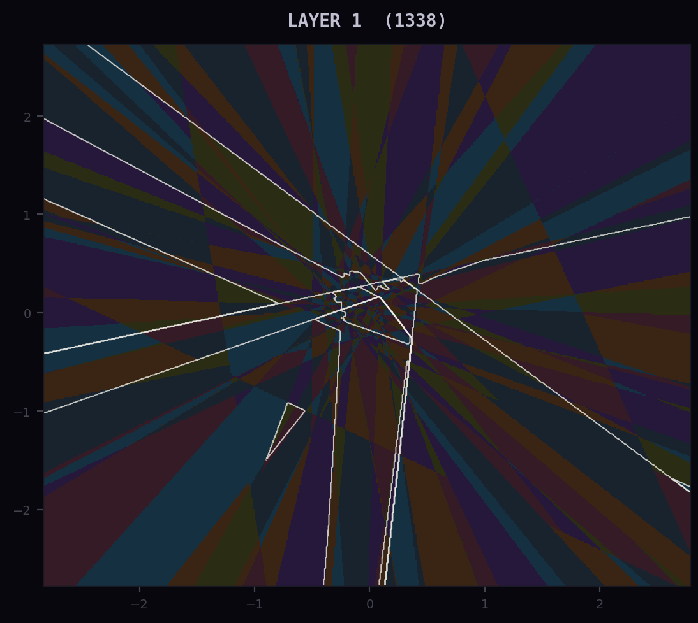
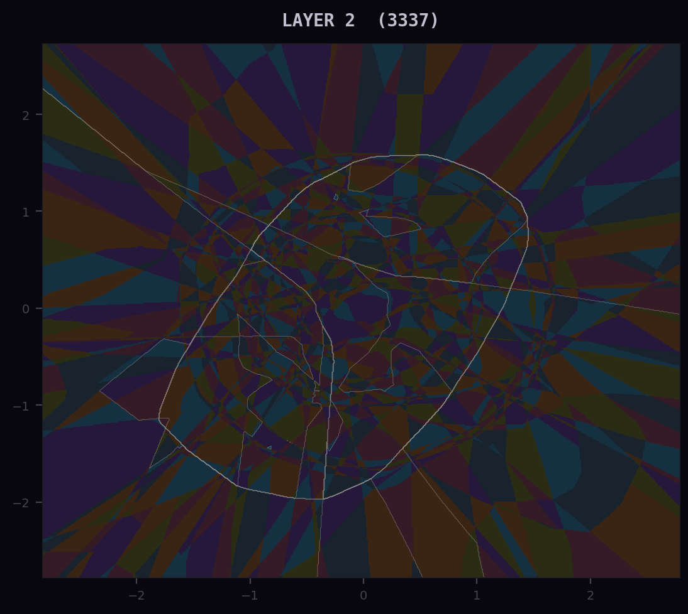
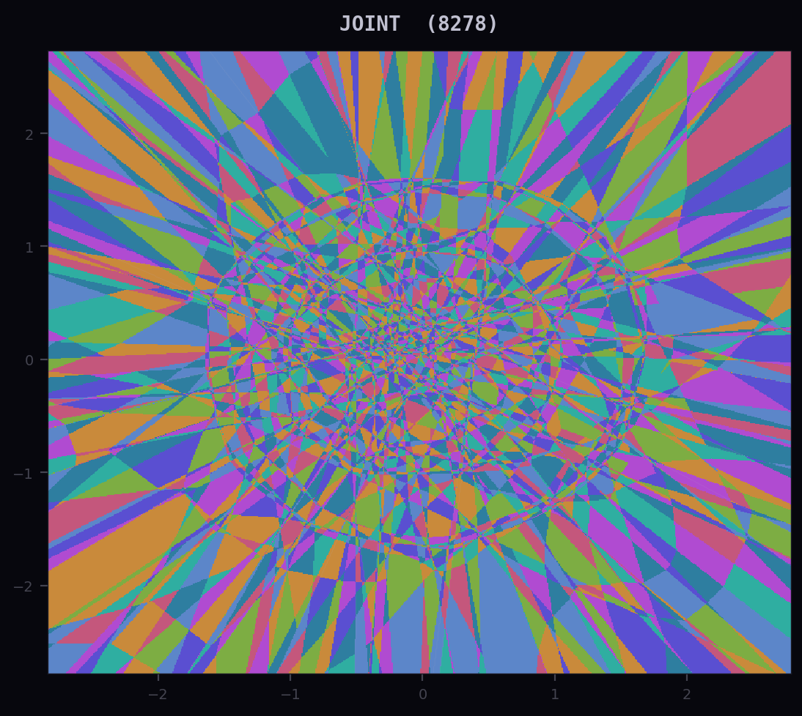
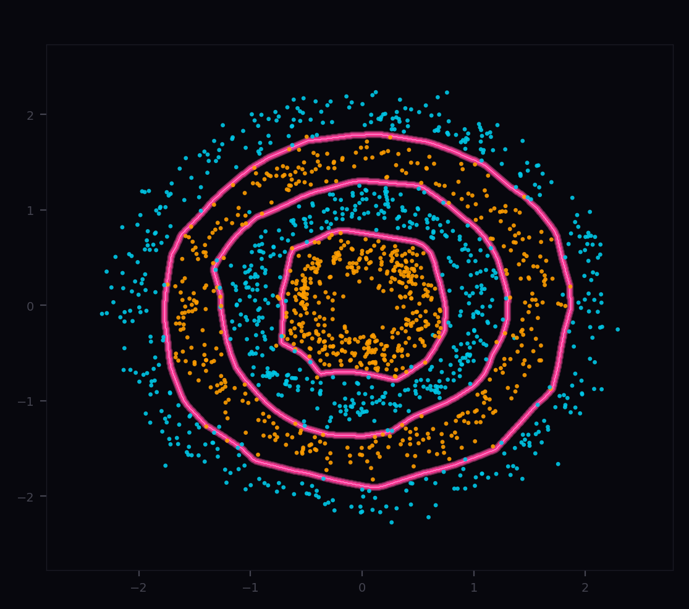
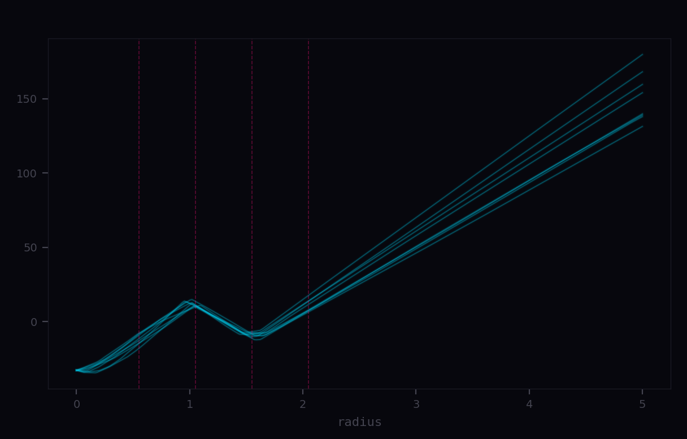
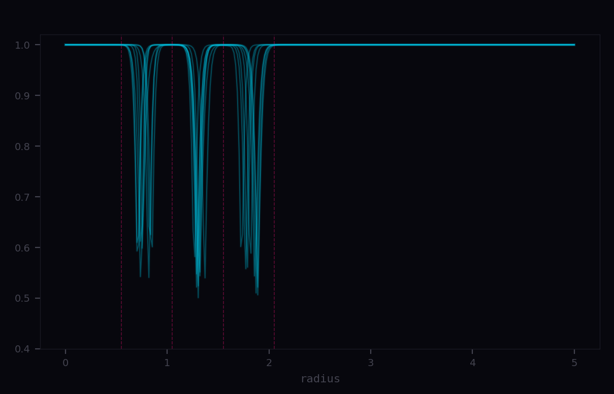

#### Neural Geometry

Building intuition for neural networks through simple models, visualization, and graphics programming. For the full write-up, see [adamsioud.com/projects/neural-geometry](https://www.adamsioud.com/projects/neural-geometry.html). The project uses NumPy, Numba, Matplotlib, and OpenGL, and is also very much a teaching ground for those too.

---

##### Setup

```bash
uv sync
```

##### Run

```bash
uv run neural-geometry [command]
```

| command | description |
|---|---|
| `simple` | simple neural network |
| `speed` | forward pass and linear-region benchmark |
| `relu` | layerwise ReLU regions and decision boundary |
| `bayesian` | MAP vs LLLA confidence maps |
| `relu-gl` | interactive linear regions |
| `bayes-gl` | confidence field and posterior boundaries |

---

<kbd>simple</kbd> &nbsp; [neural_geometry/simple.py](neural_geometry/simple.py)

Two-class classifier built from scratch in NumPy. Inspired by [Sylvain Gugger's numpy neural net](https://sgugger.github.io/a-simple-neural-net-in-numpy.html).

<kbd>speed</kbd> &nbsp; [neural_geometry/speed.py](neural_geometry/speed.py)

Two benchmarks: a dense forward pass and a linear-region labeling pass over a 2D grid. NumPy wins on the dense, vectorized case; Numba pulls ahead on the loop-heavy grid pass. I'm using this experiment to get a better feel for where Numba actually helps in practice, especially in the kind of numerical and visualization code that shows up around projects like this. For a concise introduction, see [Python⇒Speed](https://pythonspeed.com/articles/numba-faster-python/).

```
forward pass, 200 samples, 2 → 32 → 32

  python      30.75 ms
  numpy       0.0209 ms    1470x faster than python
  numba       0.0576 ms     534x faster than python    0.4x vs numpy

activation-region map, 600×600, 32 hidden units

  numpy      35.828 ms
  numba       6.963 ms     5.1x vs numpy
```

<kbd>relu</kbd> &nbsp; [neural_geometry/relu.py](neural_geometry/relu.py)

A from-scratch ReLU classifier on a radial-band dataset, with visualizations of layerwise regions, their joint partition, and the final decision boundary. Successive ReLU layers partition the plane into increasingly fine linear regions, and the decision boundary emerges from that composed structure.

Layerwise regions, their joint partition, and the resulting decision boundary:

<table>
  <tr>
    <td align="center"></td>
    <td align="center"></td>
    <td align="center"></td>
    <td align="center"></td>
  </tr>
  <tr>
    <td align="center"><sub>Layer 1</sub></td>
    <td align="center"><sub>Layer 2</sub></td>
    <td align="center"><sub>Joint partition</sub></td>
    <td align="center"><sub>Decision boundary</sub></td>
  </tr>
</table>

Radial probes through the trained network:

<table>
  <tr>
    <td align="center"></td>
    <td align="center"></td>
  </tr>
  <tr>
    <td align="center"><sub>Logit difference vs radius</sub></td>
    <td align="center"><sub>Confidence vs radius</sub></td>
  </tr>
</table>

Along a fixed ray, the logit difference changes piecewise linearly, with kinks where the activation pattern changes. Confidence stays high almost everywhere and dips mainly near class transitions.

<kbd>bayesian</kbd> &nbsp; [neural_geometry/bayesian.py](neural_geometry/bayesian.py)

Binary classifier with a diagonal last-layer Laplace approximation (LLLA), inspired by [Kristiadi et al. 2020](https://arxiv.org/abs/2002.10118). MAP vs LLLA confidence maps, a 1D confidence probe along the x-axis, and a prior-std sweep. The MAP network stays confident far from training data; the Bayesian last layer pulls confidence back toward 0.5 where data is sparse.

<kbd>relu-gl</kbd> &nbsp; [neural_geometry/gl1_geometry.py](neural_geometry/gl1_geometry.py)

Interactive OpenGL viewer for the linear regions a ReLU network creates. Move the mouse to highlight the region under the cursor. The decision boundary glows red. Pan with drag, zoom with scroll.

<kbd>bayes-gl</kbd> &nbsp; [neural_geometry/gl2_binary.py](neural_geometry/gl2_binary.py)

OpenGL viewer comparing MAP and LLLA confidence side by side. The color encodes class (orange / teal) and saturation encodes conviction. MAP stays vivid everywhere, LLLA fades to grey far from training data. Sampled posterior decision boundaries are drawn as a pink fan: tight near the data, spreading out where the model is uncertain. The divider sweeps automatically.
